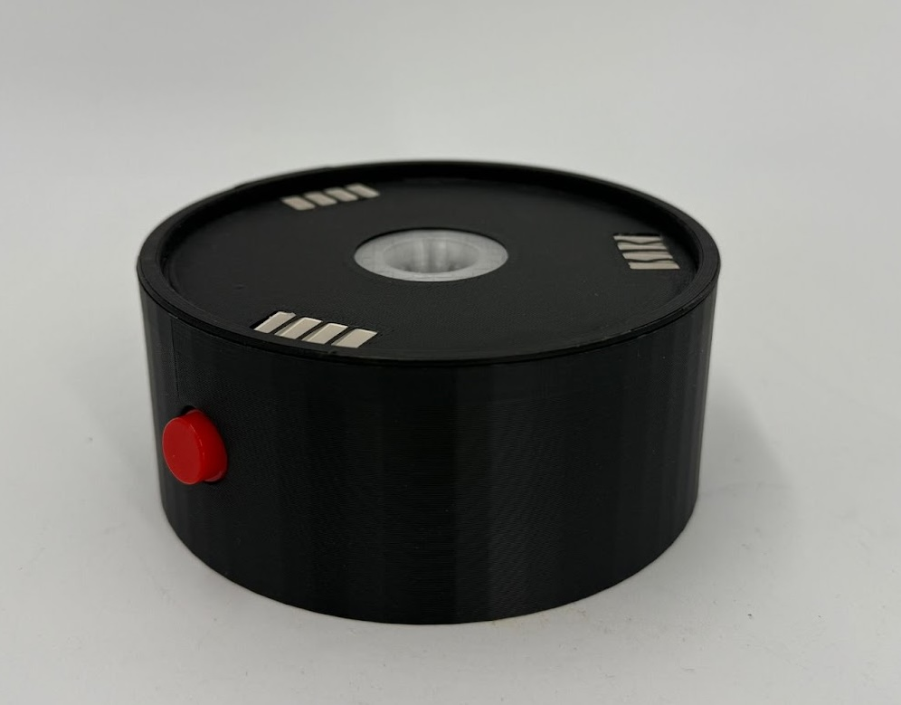
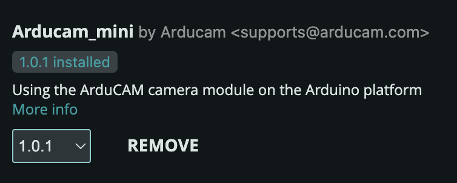
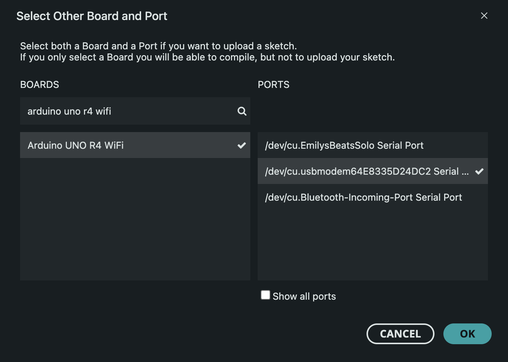

# Smart Coaster
__"a tangible user interface designed to support remote workers by tracking caffeine intake, encouraging breaks, and promoting team bonding"__




# Libraries
All dependencies are in requirements.txt. More information will be in the setup instructions to run the code. The following libraries are used directly:
| Library                          | Description                                                                                                                             |
|----------------------------------|-----------------------------------------------------------------------------------------------------------------------------------------|
| **pyserial**                     | Enables serial communication between the Python script and the Arduino board for sending control commands and receiving JPEG image data. |
| **numpy**                        | Provides high-performance array structures and numerical methods for preparing and analyzing raw image buffers and computing pixel statistics. |
| **subprocess**                   | Launches external applications (e.g., opening a Zoom link) in a cross-platform manner.                                                    |
| **json**                         | Serializes timestamps, file paths, and drink counts into structured JSON for easy downstream consumption.                                |
| **datetime**                     | Generates precise timestamps for naming and organizing captured images.                                                                  |
| **os** & **pathlib**             | Manage filesystem paths, directory creation, and file-existence checks when saving and reading images.                                   |
| **typing** & **typing_extensions** | Add type annotations (e.g., `Optional`, `Tuple`, `Literal`) to improve readability and catch potential issues during development.        |
| **dataclasses**                  | Provides the `@dataclass` decorator to define structured containers for image analysis results.                                          |
| **cv2**                          | The OpenCV library used to load images and perform core image processing tasks like cropping and pixel access.                           |
| **matplotlib.pyplot**            | Used for visualizing intermediate results or saving plots during image analysis in `analyzer.py`.                                         |
| **pandas**                       | Organizes and manages tabular data for logging or exporting analysis results within `analyzer.py`.                                        |
| **Arducam_mini**                 | Provides functions to interface with the Arducam Mini camera on the Arduino for capturing and transferring JPEG image data.               |


# Setup Instructions
## Arduino
1. Download the Arduino IDE. A tutorial can be found [here](https://docs.arduino.cc/software/ide-v2/tutorials/getting-started/ide-v2-downloading-and-installing/).
2. Within the Arduino IDE, install the `Arducam_mini` library by Arducam.  
   
3. Using your file explorer, locate and replace the default Arducam headers:
   - Open your Arduino folder (commonly `Documents/Arduino`). Go to `libraries` → `Arducam_mini` → `src`.
   - In this project’s `arduino_settings` folder, copy `ArduCAM.h` and `memorysaver.h` into `src`, replacing the existing default files.
4. Plug in the coaster with USB-C cable. Use a USB-C cable that supports data transfer (not just charging).
5. Choose the board and port.  
    - For the board, choose `arduino uno r4 wifi`. 
    - Select the port that the coaster is plugged into. In my example, it is `/dev/cu.usbmodem64E8335D24DC2`. This port will also be used in the python code!

   

## Python
1. Create a Python virtual environment using the same interpreter version:
   ```bash
   python3 -m venv .venv
   ```
2. Activate the virtual environment (macOS)
    ```bash
    source .venv/bin/activate
    ```
3. Install all dependencies (this reads from `requirements.txt`):
   ```bash
   make
   ```
4. Run the main application:
   ```bash
   python main.py
   ```
5. Open `main.py` and update the `SERIAL_PORT` constant (line 21) to match your Arduino’s port.
    - This was [step 5](#arduino) above. In my example, it is `/dev/cu.usbmodem64E8335D24DC2`.


## Running the Coaster
Before running, ensure you have completed both the [Arduino](#arduino) and the [Python](#python) setup instructions above.

1. In the Arduino IDE, open the Arduino sketch (`arduino.ino`) located in this project’s `arduino_settings` folder and upload it to your coaster.
2. Once the Arduino sketch is running, activate your Python virtual environment (instructions above) and launch the main application:
   ```bash
   python main.py
   ```

# Interacting with the Smart Coaster
The Smart Coaster supports detection of three drink types—coffee, fruit punch (red juice), and water. It requires a clear glass cup to function correctly.

1. Initialization (Empty‐Cup Calibration)
   - Follow the [Setup Instructions](#setup-instructions) above to configure the Smart Coaster
   - Place an **empty** glass cup on the coaster. Plug in the coaster.
   - All LEDs will flash **10 times**. This captures the “empty cup” reference image (ceiling) for the liquid detection algorithm.

2. Drinking Session
   - After calibration completes, fill the **same** glass cup with one of the supported drinks.
   - Enjoy your beverage normally.

3. Completion & Counting
   - The coaster continuously monitors the liquid level.
   - Once the cup is empty again, the coaster automatically increments the counter for that drink type.
   - The updated count is displayed via the LED indicators (up to four LEDs per drink type).

Notes:
- Always start each session with an empty **glass** cup to calibrate properly. If you switch glasses or locations, delete the photo `data/empty.jpg`.


# Contributions
**Cindy and Malahim**
- Low-fidelity paper prototype
- Ideation and user-scenario development
- Zoom integration and button
- Website
- Presentation slide deck creation

**Emily**
- 3D modeling (Onshape) and 3D-printed final prototype
- Design of electrical components, including 3 custom PCBs and LED indicator functionality
- Computer vision liquid detection algorithm and camera software
- Arduino+Python software, including Zoom integration and physical button control
- Documentation and 3D views
- Hardware assembly
- Ideation, storyboarding, and high-fidelity prototyping

### Resources Used
- **3D Modeling:** Onshape  
- **3D Printing:** Bamboo Studio, PrusaSlicer  
- **Electronics Design:** KiCad  
- **Milling:** Bantam Tools
- **Facilities:** MIT Edgerton Center and MIT Electronics Mezzanine  
- **AI Tools:** ChatGPT, Gemini  
